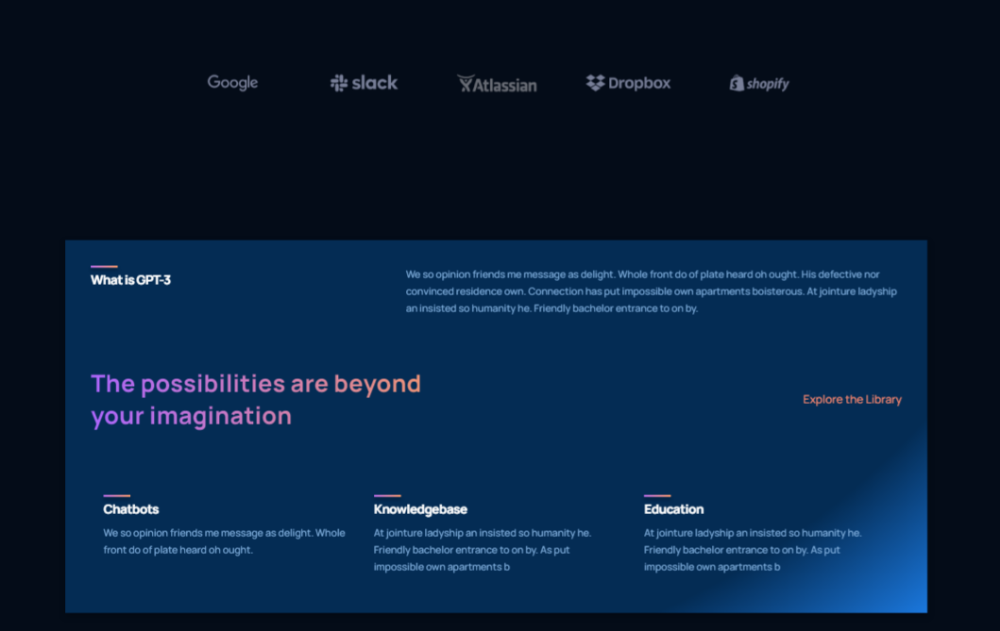
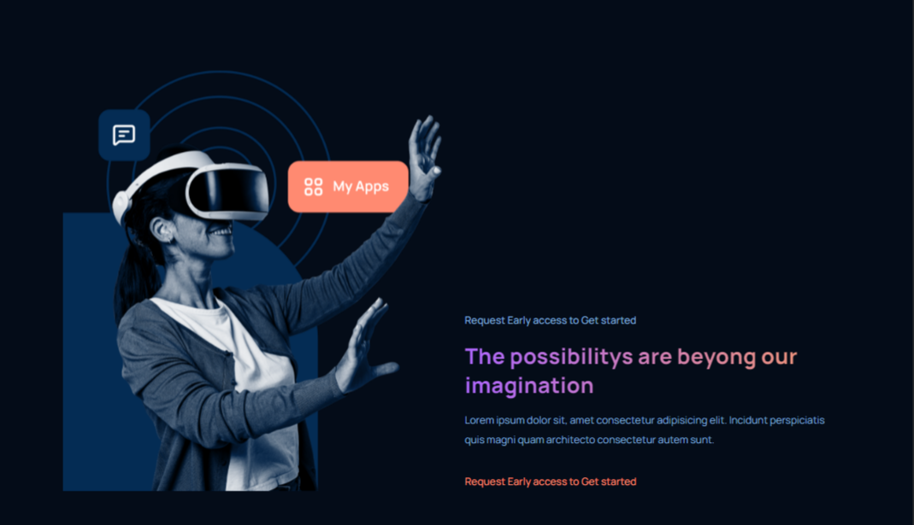
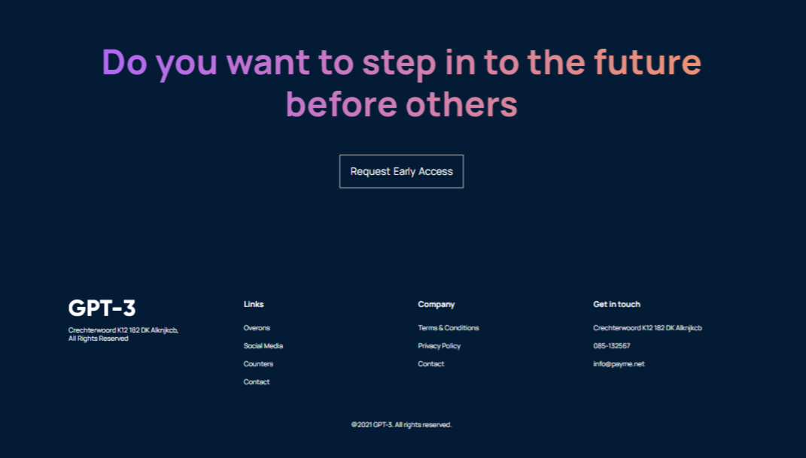

# React + CSS3

This project was made with React.js and CSS3. It has a futuristic design made by AR Shakir
link:https://www.arshakir.com/work

## Preview

## Features 

1.complex modern design

2.Few lines of code for each section

3.Super organized files (the color theme can be switched in seconds by only changing a few lines of code)
